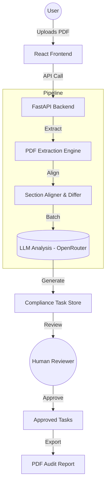

# 🔍 RegLens

**AI-Assisted Regulatory Change Analysis with Human-in-the-Loop Governance.**

[](https://reglens-sand.vercel.app)
[](https://reglens-sgxn.onrender.com)
[](https://opensource.org/licenses/MIT)
[](https://www.python.org/)
[](https://reactjs.org/)

RegLens is a high-performance regulatory compliance platform designed to bridge the gap between deterministic document analysis and AI-driven insights. It empowers compliance teams to detect, explain, and act upon regulatory changes with a **"Human-in-the-Loop"** philosophy, ensuring auditability and stability at every step.

---

## 📽️ Demo & Visuals


> [!TIP]
> **Watch the Demo Video**: (https://github.com/keeertu/reglens/blob/main/Reglens_Demo.mp4)

---

## 🌐 Live Demo
Frontend: https://reglens-sand.vercel.app  
Backend API: https://reglens-sgxn.onrender.com  

---

## 📝 The Problem

Regulatory changes are frequent, complex, and high-stakes. Organizations often struggle with:
- **Noise**: Sifting through hundreds of pages to find a single clause change.
- **Explainability**: Understanding the *impact* of a wording change, not just the diff.
- **Risk**: Hallucinations in AI that lead to compliance failures.
- **Auditability**: Keeping track of who reviewed and approved what change.

## ✨ The Solution: RegLens

RegLens solves this by combining **deterministic comparison** with **batched LLM analysis**:
1. **Precision Extractor**: Uses PyMuPDF and custom regex to align sections of old vs. new regulations.
2. **Impact Analyzer**: Breaks changes into small chunks and uses LLM (GPT-4o/DeepSeek) to explain the *compliance impact*.
3. **Governance Engine**: Every AI-generated task starts as *Pending*. A human must review and approve it.
4. **Audit Trail**: Generates a tamper-evident PDF report of all approved tasks and review metadata.

---

## 🚀 Key Features

- **🎯 Precision Comparison**: Bit-for-bit and section-aware comparison of PDF/TXT documents.
- **🤖 Intelligent Explainability**: Transforms complex legal diffs into actionable compliance tasks.
- **⏳ Sequential Batching**: Anti-burst LLM execution to bypass rate limits and ensure maximum stability.
- **👤 Human-in-the-Loop (HITL)**: Mandatory review workflow for zero-hallucination compliance.
- **📄 Audit-Ready Export**: One-click professional PDF reports for regulators.
- **⚡ Enterprise Handling**: Stream-processed file handling for documents up to 200MB.

---

## 🏗️ Technical Architecture



---

## 🛠️ Tech Stack

### Frontend
- **Framework**: React 18+ with Vite
- **Styling**: Tailwind CSS & shadcn/ui
- **State Management**: React Hooks & Context API
- **Networking**: Axios / Native Fetch with CORS hardening

### Backend
- **Engine**: FastAPI (Python 3.9+)
- **LLM**: OpenRouter (GPT-4o, DeepSeek-V3)
- **PDF Core**: PyMuPDF (fitz)
- **Reporting**: FPDF
- **Security**: UUID isolation, Semaphore Concurrency Caps

---

## 📐 Innovation & Design Decisions

- **Sequential Batching**: Rather than sending full documents (risky token costs & rate limits), we process small clusters of changes sequentially. This ensures the output is focused and high-quality.
- **Watchdog State Management**: Since this is a high-performance app, we implemented a server-side "Watchdog" that clears in-memory state after 30 minutes of inactivity to prevent memory leaks.
- **CORS Hardening**: Strict origin validation and pre-flight handling for cross-domain production stability (Vercel + Render).

---

## ⚡ Local Setup

### 1. Backend
```bash
# Clone the repo
git clone https://github.com/keeertu/reglens.git
cd backend

# Setup environment
python -m venv venv
source venv/bin/activate  # Windows: .\venv\Scripts\activate
pip install -r requirements.txt

# Create .env file
# OPENROUTER_API_KEY=your_key
# OPENROUTER_MODEL=openai/gpt-4o

# Run
uvicorn main:app --reload
```

### 2. Frontend
```bash
cd frontend
npm install
npm run dev
```

---

## 🏆 Hackathon Context

- **Event**: Built during **HackXios 2k25** (36-hour sprint).
- **Focus**: Real-world usability in highly regulated sectors (Finance, Healthcare, Law).
- **Core Value**: Moving from "AI Hype" to "AI Governance".

---

## 👥 The Team

- **Keerat Khanuja** - [LinkedIn](https://www.linkedin.com/in/keerat-khanuja-4566a01aa/)
- **Naman Lalwani** - [LinkedIn](https://www.linkedin.com/in/naman-lalwani-731a34374/)
- **Neelanchal Agarkar** - [LinkedIn](https://www.linkedin.com/in/neelanchal-agarkar-2905aa234/)

---

## 🔮 Future Roadmap

- **Multi-Document RAG**: Cross-referencing between multiple regulatory bodies.
- **Persistent Storage**: Transitioning from in-memory stores to PostgreSQL.
- **Custom LLM Agents**: Letting users define "Compliance Personas" for specific industries.

---

## 📝 License

Distributed under the MIT License. See `LICENSE` for more information.

Developed with ❤️ by Team RegLens.
