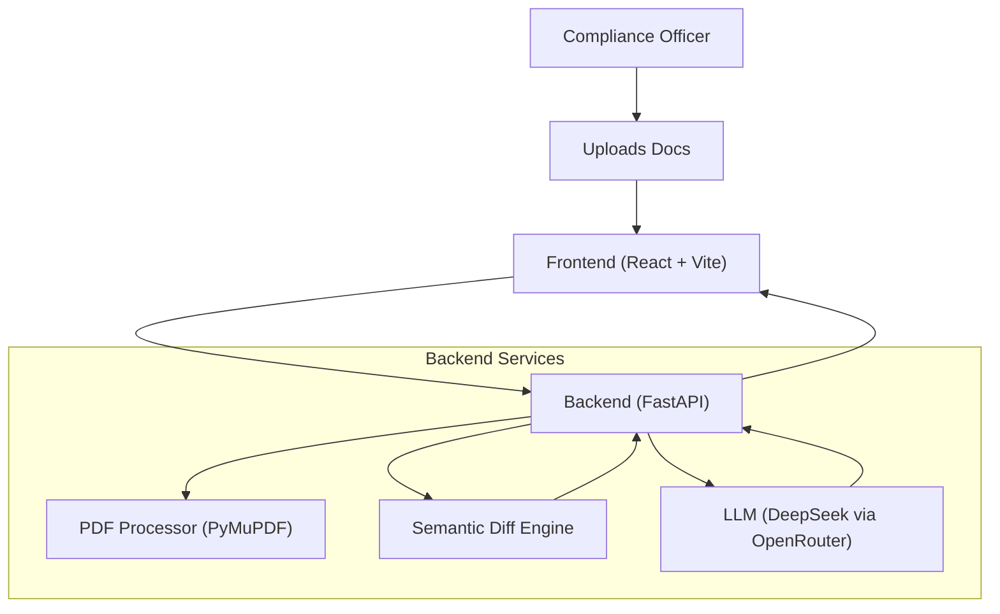

# RegLens - Regulatory Compliance Analysis Platform

**RegLens** is an AI-powered regulatory compliance platform designed to help organizations track, analyze, and adapt to changing regulations. By leveraging advanced LLMs (DeepSeek via OpenRouter), RegLens automatically detects semantic changes between regulatory documents and generates actionable compliance tasks.


---

## 🌟 Key Features

-   **Semantic Diff Analysis**: Goes beyond simple text diffs (git-style) to understand *meaningful* regulatory changes using tailored algorithms.
-   **AI-Powered Explanations**: Uses **DeepSeek-V3** (via OpenRouter) to interpret complex legal jargon and explain *why* a change matters.
-   **Automated Task Generation**: Automatically converts regulatory updates into actionable tasks (e.g., "Update Policy X", "Review Section Y") for compliance teams.
-   **PDF Support**: Native support for uploading and processing PDF regulatory documents.
-   **Modern UI**: A sleek, responsive dashboard built with React, TailwindCSS, and Framer Motion.

---

## 🏗️ Architecture

RegLens follows a modern client-server architecture:


```mermaid
graph TD
    User[Compliance Officer] --> Uploads[Uploads Docs]
    Uploads --> Frontend["Frontend (React + Vite)"]
    Frontend --> Backend["Backend (FastAPI)"]

    subgraph BackendServices["Backend Services"]
        Backend --> PDF["PDF Processor (PyMuPDF)"]
        Backend --> Diff["Semantic Diff Engine"]
        Backend --> LLM["LLM (DeepSeek via OpenRouter)"]
    end

    LLM --> Backend
    Diff --> Backend
    Backend --> Frontend

```

### Tech Stack

-   **Frontend**:
    -   React 18
    -   Vite 5
    -   TailwindCSS & Framer Motion for styling/animations
    -   Axios for API communication
-   **Backend**:
    -   Python 3.9+
    -   FastAPI (High-performance web framework)
    -   PyMuPDF (fitz) for PDF processing
    -   OpenRouter API (DeepSeek-V3 model)

---

## 🚀 Getting Started

Follow these instructions to set up the project locally.

### Prerequisites

-   **Python 3.9+** installed.
-   **Node.js 18+** installed.
-   **OpenRouter API Key**: Get one at [openrouter.ai](https://openrouter.ai/).

### 1. Backend Setup

1.  Navigate to the backend directory:
    ```bash
    cd backend
    ```

2.  Create and activate a virtual environment:
    ```bash
    # Windows
    python -m venv venv
    .\venv\Scripts\Activate

    # macOS/Linux
    python3 -m venv venv
    source venv/bin/activate
    ```

3.  Install dependencies:
    ```bash
    pip install -r requirements.txt
    ```

4.  *(Optional)* Configuration:
    -   Open `main.py` and verify/update the `OPENROUTER_API_KEY` and `MODEL_NAME` constants if you want to use your own key or a different model.
    -   *Note: For production, we recommend moving these to a `.env` file.*

5.  Run the server:
    ```bash
    uvicorn main:app --reload --host 0.0.0.0 --port 8000
    ```
    The API will be available at `http://localhost:8000`. Docs at `/docs`.

### 2. Frontend Setup

1.  Open a new terminal and navigate to the frontend directory:
    ```bash
    cd frontend
    ```

2.  Install dependencies:
    ```bash
    npm install
    ```

3.  Start the development server:
    ```bash
    npm run dev
    ```
    The application will launch at `http://localhost:5173`.

---

## 📖 Usage Guide

1.  **Upload Documents**: On the home page, select your "Old Regulation" file (PDF/Text) and the "New Regulation" file.
2.  **Analyze**: Click "Analyze Regulation". The system will process the documents, extract text, and calculate differences.
3.  **Review Changes**:
    -   **Summary**: Read the AI-generated high-level summary of what changed and why.
    -   **Detailed Diffs**: View side-by-side comparisons of specific sections.
    -   **Tasks**: Review the automatically generated compliance tasks based on the changes.
4.  **Action**: Use the tasks list to assign work to your team.

---

## 📂 Project Structure

```
reglens/
├── backend/                # Python FastAPI Backend
│   ├── main.py             # Logic entry point (API, PDF, Diff, LLM)
│   ├── requirements.txt    # Python dependencies
│   └── ...
├── frontend/               # React Frontend
│   ├── src/                # Components and Pages
│   ├── package.json        # Node dependencies
│   └── ...
└── README.md               # This file
```

---

## 🤝 Contributing

This is a hackathon project, but contributions are welcome! feel free to fork and submit a PR.

---

*Built with ❤️ for the Future of Compliance.*
